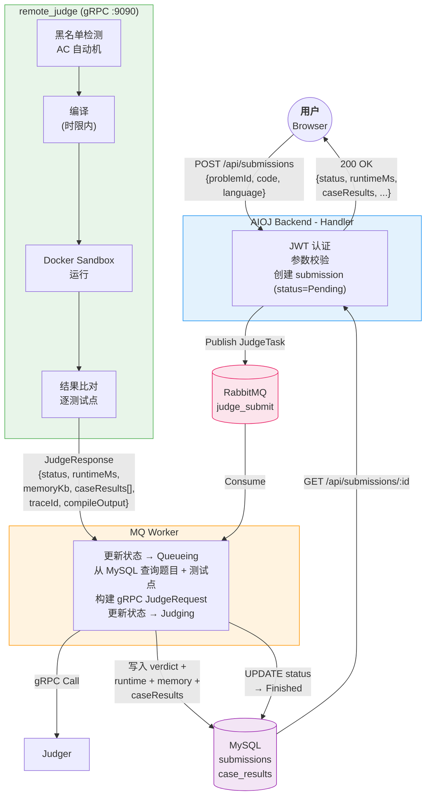

# AIOJ — TerminalOJ

> **AI-Assisted Online Judge System** — Powered by Xueye Yan and Songjq and MIMO-AI


AIOJ is an AI-assisted online judge system for programming practice. It provides problem browsing, code editing, submission judging, submission history, personal learning statistics, and AI-powered learning assistance.

The project contains a **Vue 3 frontend** and a **Go backend**. The backend uses **RabbitMQ** and **gRPC** to model an asynchronous judging pipeline — closer to a real online judge architecture than a simple synchronous demo.

---

## Table of Contents

- [Features](#features)
- [Tech Stack](#tech-stack)
- [Project Structure](#project-structure)
- [Quick Start](#quick-start)
- [Default Account](#default-account)
- [API Overview](#api-overview)
- [Judging Pipeline](#judging-pipeline)
- [Development Notes](#development-notes)
- [Documents](#documents)

---

## Features

### User System
- Registration & login with JWT authentication
- User profile with solved count, rating, acceptance rate, and learning charts
- Admin management interface

### Problem Management
- Problem list with pagination, keyword search, difficulty filtering, and tag filtering
- Problem detail page with **Markdown**, **LaTeX**, and code highlighting support
- Version-controlled problem editing (52+ problems)

### Code Editor
- **Monaco Editor** — the editor that powers VS Code
- Supports **C++**, **Python3**, and **Go**
- Local draft autosave by problem and programming language

### Judging System
- Code submission and **asynchronous judging** status updates
- Queue-based pipeline with RabbitMQ and gRPC
- Rich result fields (traceId, runtime, memory, per-case results)
- Submission history with filtering and sorting

### AI Assistance
- AI chat — problem-aware assistant
- Code diagnosis — injects judge results & submission history
- Knowledge graph generation — based on learning data
- Learning support APIs — hints, solution generation, code analysis

---

## Tech Stack

### Frontend

| Category | Libraries |
|----------|-----------|
| Framework | Vue 3, Vite |
| State & Routing | Pinia, Vue Router |
| UI | Element Plus, ECharts |
| Editor | Monaco Editor |
| Rendering | marked, KaTeX, highlight.js |
| HTTP | Axios |

### Backend

| Category | Libraries |
|----------|-----------|
| Language | Go 1.21 |
| Web Framework | Gin |
| ORM | GORM |
| Database | MySQL |
| Message Queue | RabbitMQ |
| RPC | gRPC |
| Auth | JWT, bcrypt |

---

## Project Structure

```
AIOJ/
│
├── backend/                            # Go 后端
│   ├── cmd/server/                     #   HTTP API 入口
│   ├── cmd/judger/                     #   gRPC 判题服务入口
│   ├── docker/                         #   Docker Compose + 服务 Dockerfile
│   ├── internal/
│   │   ├── ai/                         #   AI 服务客户端
│   │   ├── config/                     #   配置加载器 (YAML)
│   │   ├── database/                   #   MySQL 初始化 + 种子数据
│   │   ├── handler/                    #   Gin 处理器 + 路由
│   │   ├── judger/                     #   判题客户端/服务端逻辑
│   │   ├── middleware/                 #   JWT / CORS / Recovery / Rate Limit
│   │   ├── models/                     #   GORM 模型 + DTO
│   │   ├── mq/                         #   RabbitMQ 生产者 + Worker
│   │   └── utils/                      #   通用工具函数
│   ├── proto/                          #   gRPC 协议定义
│   ├── API.md                          #   API 契约文档
│   └── config.yaml                     #   运行时配置
│
├── frontend/                           # Vue 3 前端
│   ├── src/
│   │   ├── api/                        #   前端 API 客户端
│   │   ├── components/                 #   共享 Vue 组件
│   │   ├── router/                     #   Vue Router 配置
│   │   ├── stores/                     #   Pinia 状态管理
│   │   ├── utils/                      #   Markdown 和渲染工具
│   │   └── views/                      #   页面视图
│   └── package.json
│
├── PROGRESS.md                         # 前端开发进度
└── WORK_SUMMARY.md                     # 最近改进总结
```

---

## Quick Start

### 1. Start Infrastructure

```bash
cd backend
docker compose -f docker/docker-compose.yml up -d mysql rabbitmq
```

RabbitMQ management UI: `http://localhost:15672`

### 2. Start Backend

**Terminal 1** — Judging service:
```bash
cd backend
go mod tidy
go run ./cmd/judger
```

**Terminal 2** — API service:
```bash
cd backend
go run ./cmd/server -config config.yaml
```

The backend API listens on `http://localhost:8080` by default.

### 3. Start Frontend

```bash
cd frontend
npm install
npm run dev
```

The frontend dev server runs at `http://localhost:5173` by default.

---

## Default Account

| Role | Username | Password |
|------|----------|----------|
| Regular User | `coder_test` | `123456` |
| Admin | `admin` | `123456` |

---

## API Overview

All backend APIs are under `/api`.

### Authentication

| Method | Endpoint | Description |
|--------|----------|-------------|
| POST | `/api/auth/register` | Register new user |
| POST | `/api/auth/login` | Login |

### User

| Method | Endpoint | Description |
|--------|----------|-------------|
| GET | `/api/user/profile` | Get user profile |
| PUT | `/api/user/profile` | Update user profile |

### Problems

| Method | Endpoint | Description |
|--------|----------|-------------|
| GET | `/api/problems` | List problems (pagination, search, filter) |
| GET | `/api/problems/:id` | Get problem detail |

### Submissions

| Method | Endpoint | Description |
|--------|----------|-------------|
| POST | `/api/submissions` | Submit code |
| GET | `/api/submissions` | List submissions (filtering & sorting) |
| GET | `/api/submissions/:id` | Get submission detail |

### AI

| Method | Endpoint | Description |
|--------|----------|-------------|
| POST | `/api/ai/chat` | AI chat (unified, supports mode + tool calling) |
| POST | `/api/ai/code-diagnosis` | AI code diagnosis |
| POST | `/api/ai/generate-solution` | AI solution generation |
| POST | `/api/ai/knowledge-graph` | AI learning graph |
| POST | `/api/ai/create-study-plan` | AI study plan creation |
| POST | `/api/ai/solve` | AI guided solving (hint/explain/full) |
| GET | `/api/ai/history` | Conversation history |

> See [backend/API.md](backend/API.md) for detailed request/response formats.

---

## Judging Pipeline



---

## Development Notes

### Frontend Build

```bash
cd frontend
npm run build
```

### Backend Tests

```bash
cd backend
go test ./...
```

### AI Module

- The AI module can run with a **mock implementation** when external AI service integration is disabled (`ai.enabled: false` in `backend/config.yaml`)
- When enabled, AI requests are proxied to **agent-service** (see [agent-service/README.md](../agent-service/README.md))

---

## Documents

| Document | Description |
|----------|-------------|
| [`backend/API.md`](backend/API.md) | Backend API contract |
| [`backend/PROGRESS.md`](backend/PROGRESS.md) | Backend development progress |
| [`PROGRESS.md`](PROGRESS.md) | Frontend development progress |
| [`WORK_SUMMARY.md`](WORK_SUMMARY.md) | Draft autosave improvement summary |
| [`../CLAUDE.md`](../CLAUDE.md) | Monorepo development guide |
| [`../PROJECT_GAPS.md`](../PROJECT_GAPS.md) | Project gaps & improvement plan |
