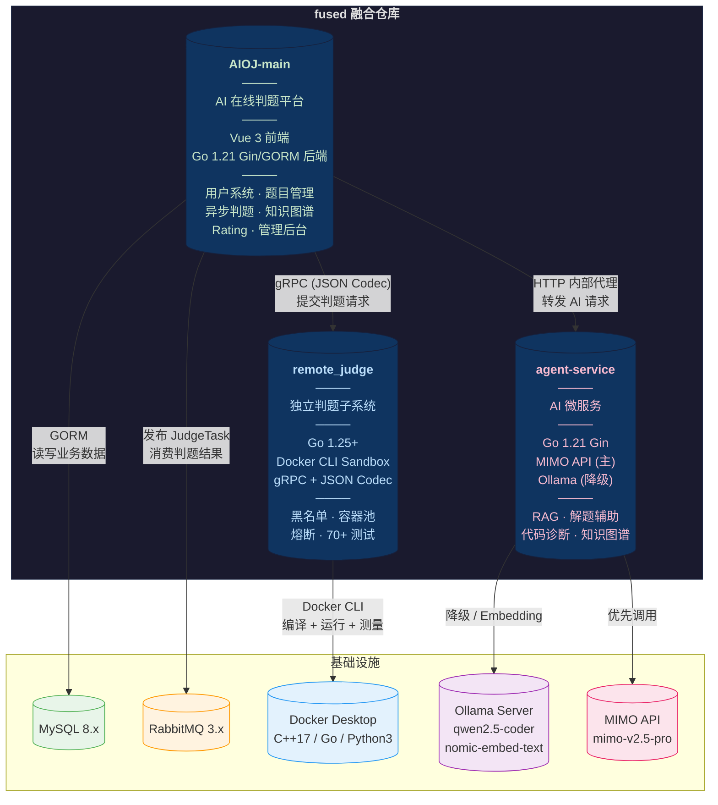
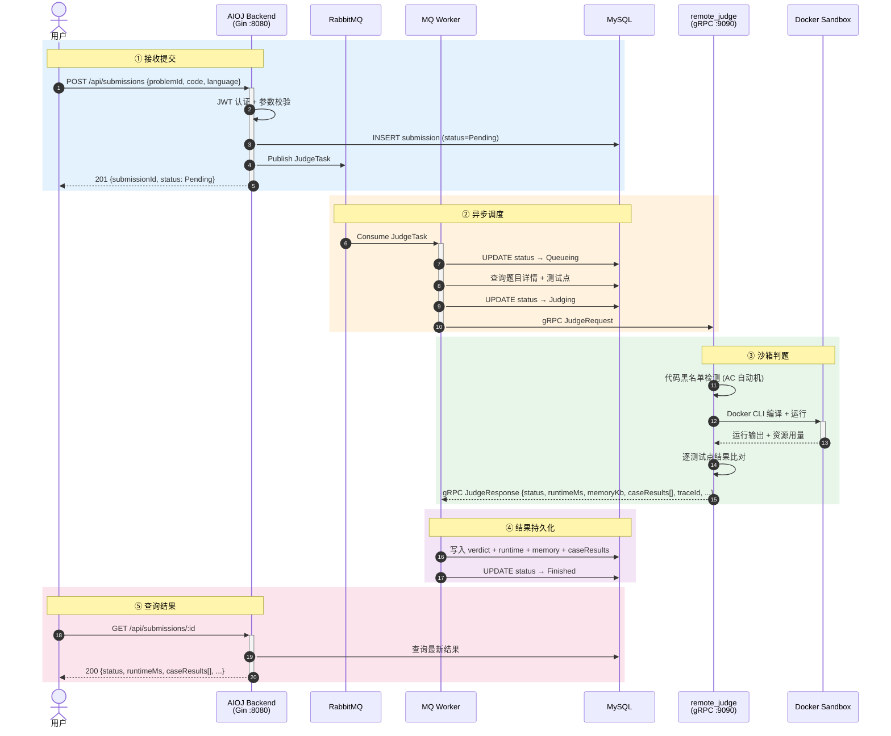
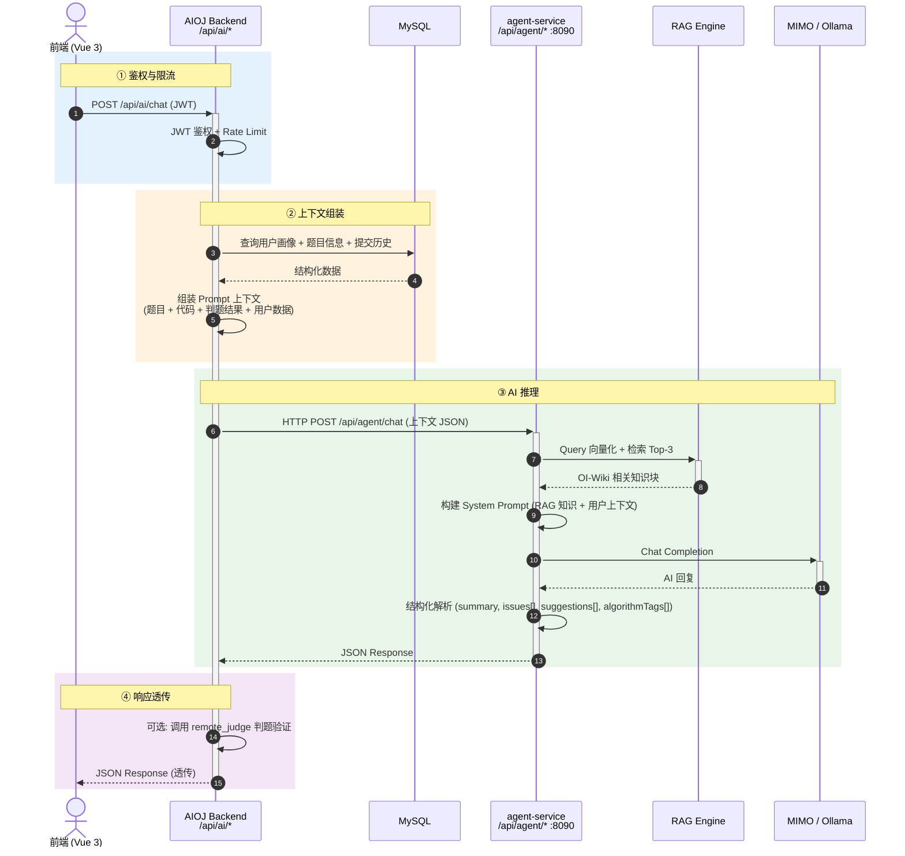

# Fused

> **融合仓库** — 将 `AIOJ-main`、`remote_judge`、`agent-service` 整合于同一代码库协同开发。


---

## 目录

- [项目概览](#项目概览)
- [整体架构](#整体架构)
- [判题链路](#判题链路)
- [AI 链路](#ai-链路)
- [仓库结构](#仓库结构)
- [技术栈](#技术栈)
- [环境要求](#环境要求)
- [快速启动](#快速启动)
- [端口总览](#端口总览)
- [默认账号](#默认账号)
- [常用命令](#常用命令)
- [相关文档](#相关文档)

---

## 项目概览

当前仓库包含三个核心子项目：

| 项目 | 职责 | 技术栈 |
|------|------|--------|
| **AIOJ-main** | AI 辅助在线判题平台 | Vue 3 + Go 1.21 (Gin/GORM) |
| **remote_judge** | 独立判题子系统 | Go 1.25+ (Docker Sandbox) |
| **agent-service** | AI 微服务 | Go 1.21 (Ollama/MIMO) |

核心特性:

- **AIOJ-main** — 用户系统、题目管理（52 道 + 版本控制）、异步判题、学习计划、知识图谱（73+ 节点）、每日推荐、Rating 系统、AI 能力转发、管理后台
- **remote_judge** — Docker 沙箱执行、代码黑名单检测、多语言支持（C++17/Go/Python3）、容器池复用、熔断降级、gRPC + HTTP 双协议、70+ 测试
- **agent-service** — 大模型对话、代码诊断、解题辅助（含沙箱验证）、知识图谱生成、RAG 检索增强（52 篇 OI-Wiki 文档向量化）、MIMO API（主）+ Ollama（降级）双模型策略

---

## 整体架构



---

## 判题链路



---

## AI 链路



> 仓库同时保留 `remote_judge/cmd/server` 作为独立判题后端入口，支持"由 remote_judge 独立托管提交队列和判题流程"的备用部署方案。

---

### 判题结果字段

当前主链路已向 `remote_judge` 的完整结果模型对齐：

| 分类 | 字段 | 说明 |
|------|------|------|
| **状态** | `status` | 4 中间态 + 7 终态: Pending / Queueing / Compiling / Running / Accepted / WA / CE / RE / TLE / MLE / OLE / SE |
| **追踪** | `traceId` | 全链路追踪 ID, 贯穿 RabbitMQ → Worker → gRPC |
| **性能** | `runtimeMs` / `memoryKb` | 运行耗时 (ms) 和内存峰值 (KB) |
| **编译** | `compileOutput` | 编译器 stdout/stderr |
| **错误** | `errorMessage` / `signal` | 错误描述 + 终止信号 |
| **测试点** | `caseResults[]` | 每个测试点的判定详情 |
| **输出** | `stdoutBytes` / `stderrBytes` | 标准输出和标准错误 |
| **时间** | `queueStartedAt` / `judgeStartedAt` / `finishedAt` | 入队、开始判题、完成时间 |

---

## 仓库结构

```
fused/
│
├── AIOJ-main/                          # AI 辅助在线判题平台
│   ├── backend/                        #   Go 后端 (Gin/GORM)
│   │   ├── cmd/server/                 #     HTTP API 入口
│   │   ├── cmd/judger/                 #     gRPC 判题服务入口
│   │   ├── docker/                     #     MySQL + RabbitMQ Compose
│   │   ├── internal/                   #     handler / models / mq / judger / ai / middleware
│   │   ├── proto/                      #     gRPC proto 定义
│   │   ├── API.md                      #     API 契约文档
│   │   └── config.yaml                 #     运行配置
│   ├── frontend/                       #   Vue 3 前端
│   │   ├── src/                        #     应用源码
│   │   └── package.json
│   └── README.md
│
├── remote_judge/                       # 独立判题子系统
│   ├── cmd/                            #   server / judger / smoke / stress 入口
│   ├── docker/                         #   判题镜像 + Compose
│   ├── internal/                       #   domain / sandbox / judger / queue / worker / ...
│   ├── docs/                           #   测试文档 + 开发周记
│   └── README.md
│
├── agent-service/                      # AI 微服务
│   ├── cmd/server/                     #   HTTP API 入口
│   ├── cmd/crawler/                    #   OI-Wiki 文档爬虫
│   ├── internal/                       #   ai / handler / rag / judge / config
│   ├── oiwiki_docs/                    #   爬取的 OI-Wiki 文档 (52 篇)
│   ├── .env                            #   配置文件 (需自行创建)
│   └── README.md
│
├── agent-service-design.md             # AI 功能详细设计
├── PROJECT_GAPS.md                     # 项目缺陷与改进计划
├── CLAUDE.md                           # 开发指南
└── README.md                           # (本文档)
```

---

## 技术栈

### AIOJ-main

| 层级 | 技术 |
|------|------|
| 前端 | Vue 3, Vite, Pinia, Vue Router, Element Plus, Monaco Editor, ECharts |
| 后端 | Go 1.21, Gin, GORM, MySQL, RabbitMQ, gRPC, JWT |

### remote_judge

| 类别 | 工具 |
|------|------|
| 语言 | Go 1.25+ |
| 沙箱 | Docker CLI Sandbox |
| 通信 | gRPC + JSON Codec |
| 队列 | Memory / RabbitMQ |
| 仓储 | Memory / MySQL |

### agent-service

| 类别 | 工具 |
|------|------|
| 语言 | Go 1.21, Gin |
| 主模型 | MIMO API (OpenAI 兼容) |
| 降级模型 | Ollama (本地) |
| 文档处理 | langchaingo |

---

## 环境要求

| 依赖 | 版本要求 | 用途 |
|------|---------|------|
| Go | 1.21+ (AIOJ / agent-service) / 1.25+ (remote_judge) | 后端编译运行 |
| Node.js / npm | 18+ | 前端编译运行 |
| MySQL | 8.x | 数据存储 |
| RabbitMQ | 3.x | 提交消息队列 |
| Docker Desktop | 最新版 | 判题沙箱运行 |
| Ollama | 可选 | agent-service 降级模型 + RAG embedding |

---

## 快速启动

以下步骤以默认集成方式为准:

```
AIOJ Backend --> RabbitMQ --> Worker --> gRPC --> remote_judge
AIOJ Backend --> agent-service
```

### 1. 启动 AIOJ 依赖 (MySQL + RabbitMQ)

```cmd
cd AIOJ-main\backend
docker compose -f docker\docker-compose.yml up -d mysql rabbitmq
```

RabbitMQ 管理面板: `http://localhost:15672` (guest/guest)

### 2. 构建判题沙箱镜像

```cmd
cd remote_judge
docker build -t remote-judge-cpp17 -f docker\images\cpp17\Dockerfile .
docker build -t remote-judge-go122 -f docker\images\go1.22\Dockerfile .
docker build -t remote-judge-python311 -f docker\images\python3.11\Dockerfile .
```

### 3. 启动 remote_judge gRPC 判题服务

```cmd
cd remote_judge
set REMOTE_JUDGE_GRPC_ADDR=127.0.0.1:9090
go run .\cmd\judger
```

### 4. 启动 agent-service

> 需要先创建 `agent-service\.env` 配置文件, 详见 [agent-service/README.md](agent-service/README.md)

```cmd
cd agent-service
go run .\cmd\server
```

### 5. 启动 AIOJ 后端

```cmd
cd AIOJ-main\backend
go run .\cmd\server -config config.yaml
```

### 6. 启动 AIOJ 前端

```cmd
cd AIOJ-main\frontend
npm install
npm run dev
```

---

## 端口总览

| 服务 | 默认端口 | 说明 |
|------|---------|------|
| AIOJ 前端 | :5173 | Vite 开发服务器 |
| AIOJ 后端 | :8080 | Gin HTTP API |
| remote_judge gRPC | :9090 | 判题服务 |
| agent-service | :8090 | AI 微服务 |
| MySQL | :3306 | 数据库 |
| RabbitMQ | :5672 | 消息队列 |
| RabbitMQ 管理 | :15672 | Web UI |

---

## 默认账号

| 角色 | 用户名 | 密码 |
|------|--------|------|
| 普通用户 | `coder_test` | `123456` |
| 管理员 | `admin` | `123456` |

---

## 常用命令

| 操作 | 命令 |
|------|------|
| AIOJ 后端测试 | `cd AIOJ-main\backend && go test ./...` |
| remote_judge 测试 | `cd remote_judge && go test ./...` |
| AIOJ 前端构建 | `cd AIOJ-main\frontend && npm run build` |
| agent-service 构建 | `cd agent-service && go build ./...` |

---

## 相关文档

| 文档 | 说明 |
|------|------|
| [AIOJ-main/README.md](AIOJ-main/README.md) | AIOJ 项目说明 |
| [AIOJ-main/backend/API.md](AIOJ-main/backend/API.md) | 后端 API 契约 |
| [AIOJ-main/frontend/API.md](AIOJ-main/frontend/API.md) | 前端接口约定 |
| [remote_judge/README.md](remote_judge/README.md) | remote_judge 项目说明 |
| [agent-service/README.md](agent-service/README.md) | agent-service 项目说明 |
| [agent-service-design.md](agent-service-design.md) | AI 功能详细设计 (Prompt、状态机、标签字典) |
| [PROJECT_GAPS.md](PROJECT_GAPS.md) | 项目缺陷与改进计划 |
| [CLAUDE.md](CLAUDE.md) | 开发指南 (命令、架构、端口) |
| [remote_judge/docs/check.md](remote_judge/docs/check.md) | remote_judge 测试引导 |
