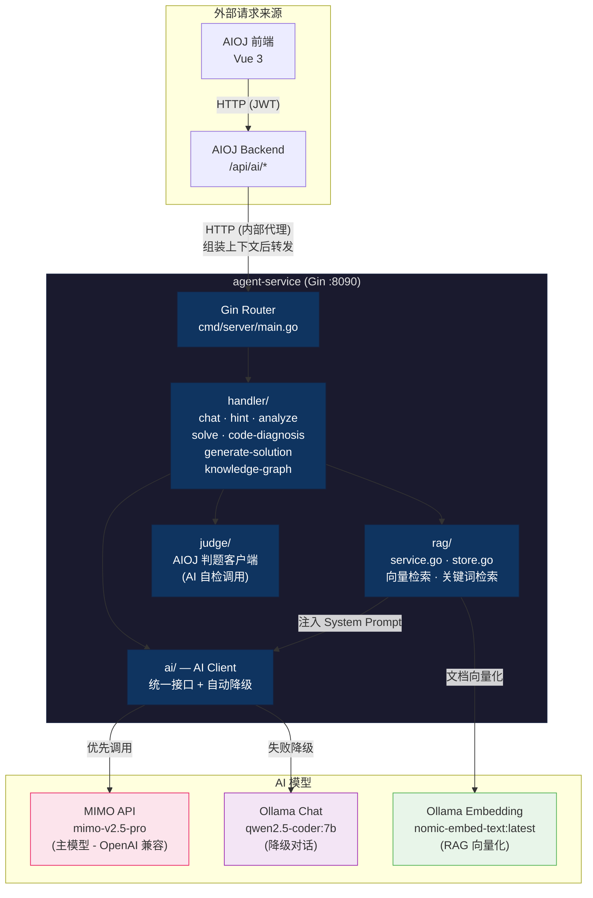
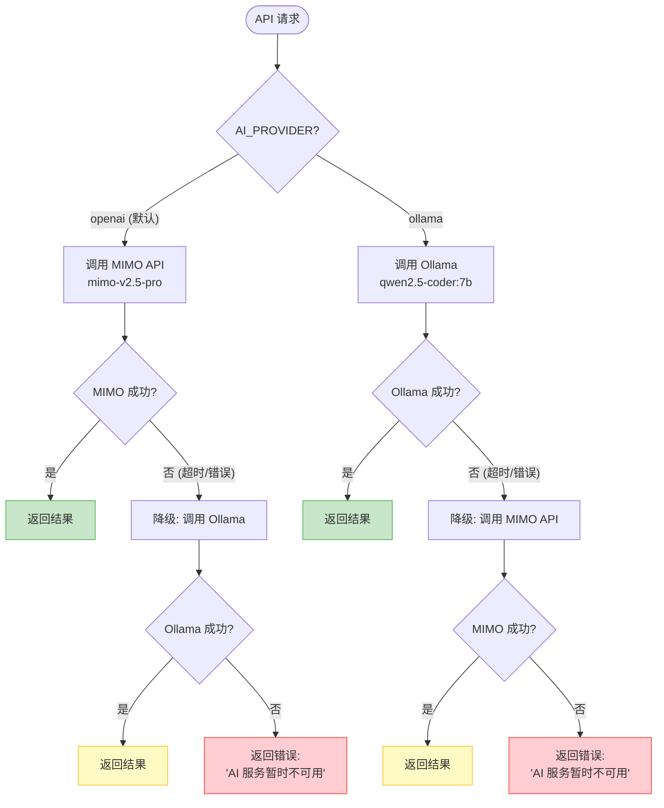
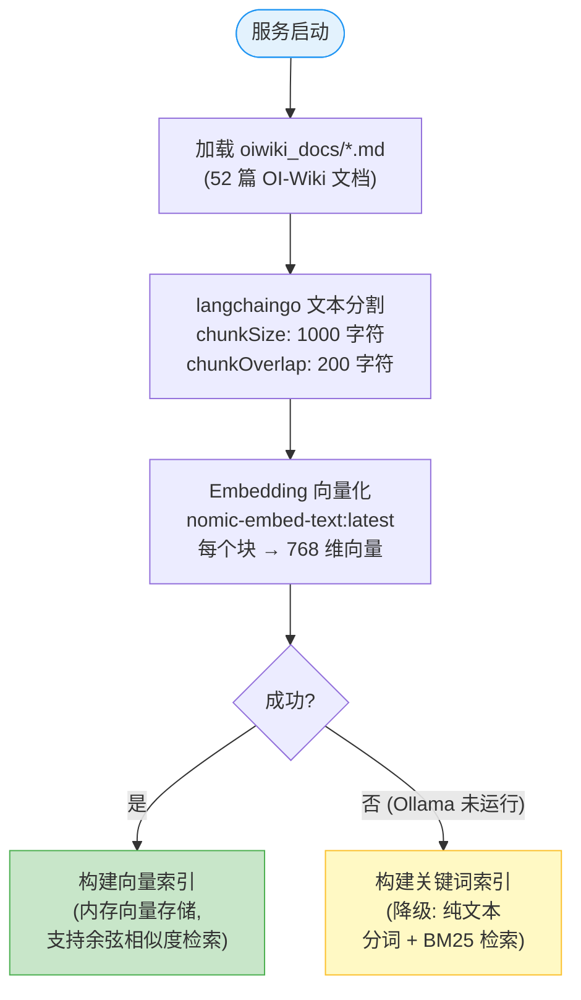
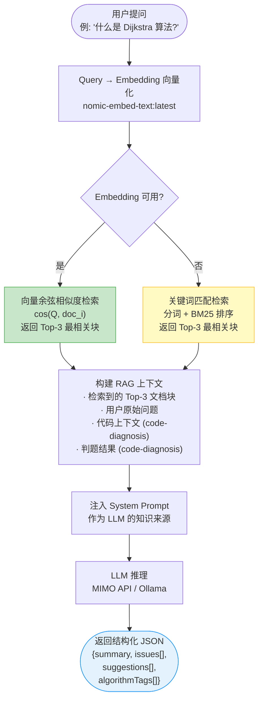
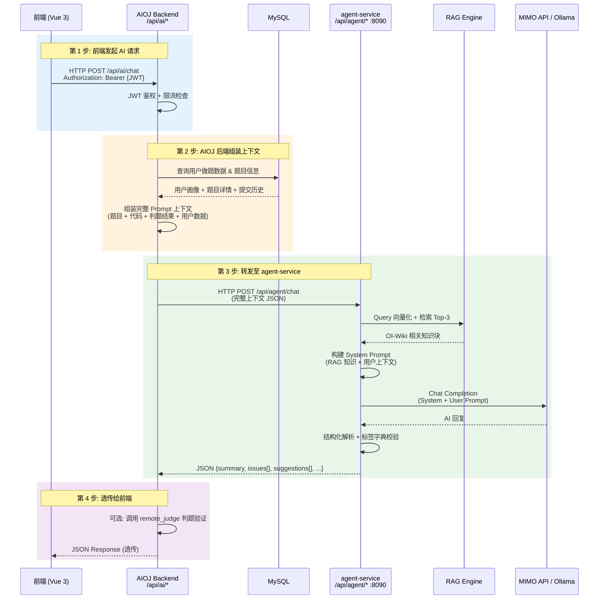

# agent-service

> **AI 微服务** — 为 AIOJ 平台提供大模型驱动的智能能力。支持 MIMO API（主）+ 本地 Ollama（降级）双模型策略，内置 RAG 检索增强。


---

## 目录

- [架构概览](#架构概览)
- [功能列表](#功能列表)
- [快速启动](#快速启动)
- [环境变量](#环境变量)
- [目录结构](#目录结构)
- [AI Provider 降级策略](#ai-provider-降级策略)
- [RAG 检索系统](#rag-检索系统)
- [与 AIOJ 后端的集成](#与-aioj-后端的集成)
- [开发指南](#开发指南)
- [相关文档](#相关文档)

---

## 架构概览



---

## 功能列表

### AI 端点

| 端点 | 方法 | 说明 | 调用方 |
|------|------|------|--------|
| `/api/agent/health` | GET | 健康检查 (含 AI 服务状态) | 运维 |
| `/api/agent/rag-status` | GET | RAG 初始化状态和文档数量 | 运维 |
| `/api/agent/chat` | POST | 通用 AI 对话 (RAG 增强) | AIOJ 后端 |
| `/api/agent/hint` | POST | 做题提示 (不泄露答案) | AIOJ 后端 |
| `/api/agent/analyze` | POST | 代码分析 (复杂度、知识点、建议) | AIOJ 后端 |
| `/api/agent/generate-solution` | POST | 辅助生成题解 | AIOJ 后端 |
| `/api/agent/code-diagnosis` | POST | 代码诊断 (注入判题结果 + 提交历史) | AIOJ 后端 |
| `/api/agent/knowledge-graph` | POST | 知识图谱生成 (基于做题数据) | AIOJ 后端 |
| `/api/agent/solve` | POST | 解题辅助 (hint / explain / full 三级) | AIOJ 后端 |

### 返回格式

所有 AI 端点返回结构化 JSON, `algorithmTags` 字段强制使用统一标签字典:

```json
{
  "summary": "问题总结",
  "timeComplexity": "**O(n log n)** -- 排序主导",
  "spaceComplexity": "**O(n)** -- 辅助数组",
  "algorithmTags": ["二分", "排序"],
  "issues": [
    {
      "line": 15,
      "severity": "warning",
      "message": "未处理空数组",
      "hint": "添加边界检查"
    }
  ],
  "suggestions": ["可使用双指针优化"]
}
```

---

## 快速启动

### 1. 环境要求

| 依赖 | 版本 | 用途 |
|------|------|------|
| Go | 1.21+ | 编译运行 |
| MIMO API Key | — | 主模型 (生产环境) |
| Ollama | 最新版 | 降级模型 + RAG embedding |
| nomic-embed-text | latest | 向量嵌入模型 |
| qwen2.5-coder:7b | 可选 | 降级对话模型 |

### 2. 创建配置文件

在 `agent-service/` 目录下创建 `.env` 文件:

```env
# HTTP 服务
AGENT_HTTP_ADDR=:8090

# AI Provider: openai (MIMO API) / ollama (本地)
AI_PROVIDER=openai
OPENAI_API_KEY=your-api-key-here
OPENAI_BASE_URL=https://token-plan-sgp.xiaomimimo.com/v1
OPENAI_MODEL=mimo-v2.5-pro

# Ollama (降级 + RAG embedding)
OLLAMA_URL=http://127.0.0.1:11434
OLLAMA_MODEL=qwen2.5-coder:7b
EMBEDDING_MODEL=nomic-embed-text:latest

# AIOJ 后端地址 (判题验证用)
AIOJ_BACKEND_URL=http://127.0.0.1:8080
```

> RAG 系统需要 Ollama 并拉取 embedding 模型: `ollama pull nomic-embed-text:latest`

### 3. 启动服务

```cmd
cd agent-service
go run .\cmd\server
```

默认监听 `http://127.0.0.1:8090`, 启动时自动加载 RAG 文档 (后台 goroutine)。

### 4. 验证

```cmd
REM 健康检查
curl http://127.0.0.1:8090/api/agent/health

REM RAG 状态
curl http://127.0.0.1:8090/api/agent/rag-status
```

---

## 环境变量

| 变量 | 默认值 | 说明 |
|------|--------|------|
| `AGENT_HTTP_ADDR` | `:8090` | HTTP 监听地址 |
| `AI_PROVIDER` | `openai` | 优先使用的 AI 提供商 (`openai` / `ollama`) |
| `OPENAI_API_KEY` | — | MIMO API Key |
| `OPENAI_BASE_URL` | `https://token-plan-sgp.xiaomimimo.com/v1` | OpenAI 兼容接口地址 |
| `OPENAI_MODEL` | `mimo-v2.5-pro` | 主模型名称 |
| `OLLAMA_URL` | `http://127.0.0.1:11434` | Ollama 服务地址 |
| `OLLAMA_MODEL` | `qwen2.5-coder:7b` | 降级模型名称 |
| `EMBEDDING_MODEL` | `nomic-embed-text:latest` | RAG embedding 模型 |
| `AIOJ_BACKEND_URL` | `http://127.0.0.1:8080` | AIOJ 后端地址 |

---

## 目录结构

```
agent-service/
│
├── cmd/
│   ├── server/                        # HTTP API 入口
│   │   └── main.go                    #   main 函数
│   └── crawler/                       # OI-Wiki 文档爬虫工具
│
├── internal/
│   ├── ai/                            # AI 客户端
│   │   ├── client.go                  #   统一接口 (自动降级)
│   │   ├── openai.go                  #   OpenAI 兼容 API (MIMO)
│   │   └── ollama.go                  #   Ollama 客户端 (含 Embedding)
│   ├── config/                        # 配置加载 (环境变量 + .env)
│   ├── handler/                       # HTTP 处理器
│   │   └── handler.go                 #   所有端点实现
│   ├── judge/                         # AIOJ 后端判题客户端
│   └── rag/                           # RAG 检索系统
│       ├── service.go                 #   RAG 服务 (加载、索引、检索)
│       └── store.go                   #   文档类型定义 + BuildContext
│
├── oiwiki_docs/                       # 爬取的 OI-Wiki 文档 (52 篇 markdown)
│   └── index.json                     #   文档索引
│
├── .env                               # 配置文件 (不提交 git)
└── go.mod
```

---

## AI Provider 降级策略

`AI_PROVIDER` 决定首选 Provider, 调用失败后自动降级:



| 场景 | 推荐 Provider | 调用顺序 |
|------|-------------|---------|
| 生产环境 | `openai` | MIMO API → Ollama → 不可用 |
| 本地开发 | `ollama` | Ollama → MIMO API → 不可用 |

---

## RAG 检索系统

### 启动阶段



### 请求检索



---

## 与 AIOJ 后端的集成

agent-service 不直接暴露给前端, 所有 AI 请求通过 AIOJ 后端代理转发:



### 上下文注入示例 (Code Diagnosis)

```json
{
  "problemId": 1001,
  "problemTitle": "两数之和",
  "problemContent": "给定一个整数数组 nums 和一个目标值 target, 找出和为 target 的两个整数并返回下标。",
  "algorithmTags": ["数组", "哈希表"],
  "code": "#include <vector>\nusing namespace std;\nvector<int> twoSum(vector<int>& nums, int target) { ... }",
  "judgeStatus": "Wrong Answer",
  "errorMessage": "期望输出 [0, 1], 实际输出 [1, 2]",
  "recentSubmissions": [
    {
      "submissionId": 2048,
      "status": "Wrong Answer",
      "code": "...",
      "errorMessage": "期望输出 [0, 1], 实际输出 [0, 0]",
      "createdAt": "2026-06-13T10:30:00Z"
    }
  ]
}
```

---

## 开发指南

### 编译与运行

```cmd
cd agent-service
go build ./...           # 编译所有包
go run .\cmd\server      # 启动服务
```

### OI-Wiki 爬虫

```cmd
cd agent-service
go run .\cmd\crawler
```

从 GitHub 获取 OI-Wiki markdown 文档, 输出到 `oiwiki_docs/` 目录。启动时 RAG 系统自动加载。

---

## 相关文档

| 文档 | 说明 |
|------|------|
| [agent-service-design.md](../agent-service-design.md) | 详细设计文档 (AI 功能、Prompt 设计、状态机、标签字典) |
| [PROJECT_GAPS.md](../PROJECT_GAPS.md) | 项目缺陷与改进计划 |
| [CLAUDE.md](../CLAUDE.md) | 开发指南 (命令、架构、端口) |
| [AIOJ-main/README.md](../AIOJ-main/README.md) | AIOJ 主项目说明 |
| [remote_judge/README.md](../remote_judge/README.md) | 判题子系统说明 |
