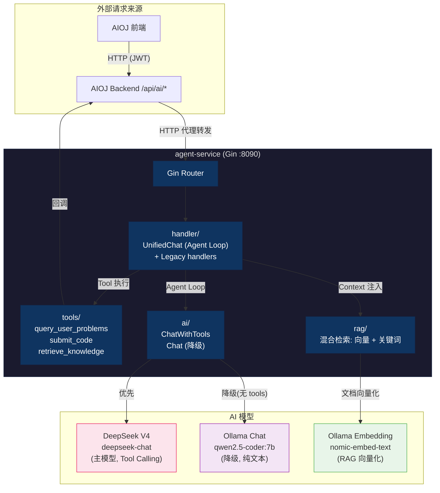

# agent-service

> **AI Agent 微服务** — 为 AIOJ 平台提供 LLM 驱动的智能能力。采用 **Tool Calling Agent** 架构，AI 可主动调用工具（查题、判题、知识检索）完成复杂任务，而非由后端硬编码编排流程。


---

## 目录

- [架构概览](#架构概览)
- [AI 端点](#ai-端点)
- [Tool Calling 工具](#tool-calling-工具)
- [Agent Loop 工作流程](#agent-loop-工作流程)
- [快速启动](#快速启动)
- [环境变量](#环境变量)
- [目录结构](#目录结构)
- [AI Provider 策略](#ai-provider-策略)
- [RAG 检索系统](#rag-检索系统)
- [与 AIOJ 后端的集成](#与-aioj-后端的集成)
- [相关文档](#相关文档)

---

## 架构概览



---

## AI 端点

### 统一 Chat 端点 (主入口)

| 端点 | 方法 | 说明 |
|------|------|------|
| `/api/agent/chat` | POST | **统一 AI Agent 端点** — 所有 AI 功能通过此端点 + `mode` 字段使用 |

### Mode 列表

| mode | 工具 | 轮数 | 用途 |
|------|------|------|------|
| `chat` | query_user_problems, retrieve_knowledge | 3 | 自由对话，可主动查题 |
| `code-diagnosis` | 无 | 0 | 代码分析（直接调 LLM） |
| `generate-solution` | 无 | 0 | 题解生成（直接调 LLM） |
| `knowledge-graph` | query_user_problems | 1 | AI 分析薄弱点 |
| `study-plan` | query_user_problems | 2 | AI 创建个性化题单 |
| `solve` | query_user_problems, submit_code, retrieve_knowledge | 3 | 解题辅助 (hint/explain/full) |

### 运维端点

| 端点 | 方法 | 说明 |
|------|------|------|
| `/api/agent/health` | GET | 健康检查 (含 AI 服务可达性) |
| `/api/agent/rag-status` | GET | RAG 初始化状态和文档块数量 |

### 遗留端点 (向后兼容)

以下端点保留以兼容旧调用方，内部转为统一 Chat：

| 端点 | 方法 | 对应 mode |
|------|------|----------|
| `/api/agent/code-diagnosis` | POST | code-diagnosis |
| `/api/agent/generate-solution` | POST | generate-solution |
| `/api/agent/knowledge-graph` | POST | knowledge-graph |
| `/api/agent/create-study-plan` | POST | study-plan |
| `/api/agent/solve` | POST | solve |

---

## Tool Calling 工具

### 工具定义

Agent 可调用以下 3 个工具，定义在 `internal/tools/tools.go`：

| 工具 | 参数 | 功能 | 执行方式 |
|------|------|------|---------|
| `query_user_problems` | `tags[]`, `status`, `difficulty` | 查询用户做题记录 + 知识点统计 | HTTP → OJ `/api/agent/problems` |
| `submit_code` | `problem_id`, `code`, `language` | 提交代码评测 | HTTP → OJ `/api/agent/judge` |
| `retrieve_knowledge` | `tags[]`, `query` | 从 OI-Wiki 检索算法知识 | 本地 RAG 引擎 |

### 示例：LLM 主动调用工具

```
用户: "帮我找几道没做过的动态规划题"

Agent Loop:
  ① LLM 分析: 需要查用户做题记录
     → 调用 query_user_problems({tags: ["动态规划"], status: "untried"})
     → OJ 返回 [{id: 1010, "零钱兑换"}, ...]
  ② LLM 基于结果回答: "以下是你没做过的 DP 题: ..."
```

---

## Agent Loop 工作流程

```mermaid
flowchart TD
    Start(["POST /chat {mode, messages, problem}"]
    Init["根据 mode 选择工具 + maxRounds"]
    Loop{"Agent Loop (≤ maxRounds)"}
    LLM["调用 LLM (ChatWithTools)"]
    HasTools{"有 tool_calls?"}
    Exec["执行工具<br/>(HTTP → OJ 或本地 RAG)"]
    Append["工具结果追加到 messages"]
    Done["返回最终回复"]

    Start --> Init
    Init --> Loop
    Loop -->|"否 (超限)"| Done
    Loop --> LLM
    LLM --> HasTools
    HasTools -->|"否"| Done
    HasTools -->|"是"| Exec
    Exec --> Append
    Append --> Loop

    style Start fill:#e3f2fd,stroke:#2196f3
    style Done fill:#c8e6c9,stroke:#4caf50
    style LLM fill:#fce4ec,stroke:#e91e63
    style Exec fill:#fff3e0,stroke:#ff9800
```

---

## 快速启动

### 1. 环境要求

| 依赖 | 版本 | 用途 |
|------|------|------|
| Go | 1.21+ | 编译运行 |
| DeepSeek API Key | — | 主模型 (支持 Tool Calling) |
| Ollama | 最新版 | RAG embedding (必需) + 降级对话 (可选) |
| nomic-embed-text | latest | 向量嵌入模型 (需 `ollama pull`) |

### 2. 创建配置文件

```env
# DeepSeek V4 Flash (OpenAI-compatible)
AI_PROVIDER=openai
OPENAI_API_KEY=sk-your-deepseek-api-key
OPENAI_BASE_URL=https://api.deepseek.com/v1
OPENAI_MODEL=deepseek-chat
AI_THINKING=false

# Ollama (降级 + RAG embedding)
OLLAMA_URL=http://127.0.0.1:11434
OLLAMA_MODEL=qwen2.5-coder:7b
EMBEDDING_MODEL=nomic-embed-text:latest

# OJ 后端地址 (Tool 执行用)
OJ_BASE_URL=http://127.0.0.1:8080
```

### 3. 拉取 Embedding 模型

```bash
ollama pull nomic-embed-text:latest
```

### 4. 启动

```cmd
cd agent-service
go run .\cmd\server
```

服务启动在 `http://127.0.0.1:8090`，RAG 文档在后台 goroutine 异步加载。

### 5. 验证

```cmd
curl http://127.0.0.1:8090/api/agent/health
curl http://127.0.0.1:8090/api/agent/rag-status
```

---

## 环境变量

| 变量 | 默认值 | 说明 |
|------|--------|------|
| `AGENT_HTTP_ADDR` | `:8090` | HTTP 监听地址 |
| `AI_PROVIDER` | `openai` | 优先 AI 提供商 (`openai` / `ollama`) |
| `OPENAI_API_KEY` | — | DeepSeek API Key |
| `OPENAI_BASE_URL` | `https://api.deepseek.com/v1` | OpenAI 兼容接口地址 |
| `OPENAI_MODEL` | `deepseek-chat` | 主模型名称 |
| `AI_THINKING` | `false` | 是否启用 LLM thinking (Tool Calling 时自动禁用) |
| `OLLAMA_URL` | `http://127.0.0.1:11434` | Ollama 服务地址 |
| `OLLAMA_MODEL` | `qwen2.5-coder:7b` | 降级模型 (不支持 Tool Calling) |
| `EMBEDDING_MODEL` | `nomic-embed-text:latest` | RAG embedding 模型 |
| `OJ_BASE_URL` | `http://127.0.0.1:8080` | OJ 后端地址 (Tool 执行用) |

---

## 目录结构

```
agent-service/
│
├── cmd/server/                   # HTTP API 入口
│
├── internal/
│   ├── ai/                       # AI 客户端
│   │   ├── client.go             #   统一接口 Chat + ChatWithTools
│   │   ├── openai.go             #   OpenAI 兼容 API (Tool Calling)
│   │   └── ollama.go             #   Ollama 客户端 (Embedding + 降级)
│   ├── config/                   # 配置加载 (环境变量 + .env)
│   ├── handler/                  # HTTP 处理器
│   │   └── handler.go            #   UnifiedChat (Agent Loop) + 遗留 handler
│   ├── tools/                    # ★ Tool Calling 工具系统
│   │   ├── tools.go              #   工具定义 (3 个工具的 JSON Schema)
│   │   ├── mode.go               #   Mode → 工具映射 + 最大轮数配置
│   │   └── executor.go           #   工具执行器 (HTTP → OJ / 本地 RAG)
│   └── rag/                      # RAG 检索系统
│       ├── service.go            #   混合检索 (向量 + 关键词) + 文档加载
│       └── store.go              #   文档类型 + BuildContext
│
├── oiwiki_docs/                  # OI-Wiki 文档 (600 个向量块)
│   └── .embedding_cache.json     #   Embedding 缓存 (重启不重算)
│
├── .env                          # 配置文件 (不提交 git)
└── go.mod
```

---

## AI Provider 策略

| 场景 | 主模型 | 降级模型 | Tool Calling |
|------|--------|---------|-------------|
| 生产环境 | DeepSeek V4 (deepseek-chat) | Ollama qwen2.5-coder:7b | ✅ DeepSeek 支持 |
| Ollama only | — | Ollama | ❌ 自动降级为纯文本对话 |

> **重要**: 当模型降级到 Ollama 时，Tool Calling 不可用，AI 将以纯文本模式回答，无法主动调用工具。

---

## RAG 检索系统

### 数据加载

- 启动时从 `oiwiki_docs/` 加载 OI-Wiki markdown 文档
- langchaingo `RecursiveCharacter` 分割器：chunk 1000 字符，overlap 200 字符
- 通过 Ollama `nomic-embed-text` 生成 600 个文档块的向量
- 嵌入缓存到 `.embedding_cache.json`，重启不重算

### 检索策略

- 有 embedding 时：余弦相似度检索 (阈值 > 0.1)
- 无 embedding 时：关键词匹配降级 (分词 + 匹配比例)
- 支持多查询合并去重 (`SearchMulti`)
- 返回 Top-5 最相关文档块作为 LLM 知识注入 System Prompt

---

## 与 AIOJ 后端的集成

agent-service 不直接暴露给前端，所有 AI 请求通过 AIOJ 后端代理：

```
前端 POST /api/ai/chat (JWT)
  → AIOJ Backend: JWT 鉴权 + 组装上下文 (题目信息)
  → HTTP POST → agent-service /api/agent/chat
      → Agent Loop: LLM 推理 → 工具调用 → 推理
  → 返回结构化回复
  → AIOJ Backend 透传给前端
```

---

## 相关文档

| 文档 | 说明 |
|------|------|
| [../README.md](../README.md) | 融合仓库总览 + 初始配置 |
| [../CLAUDE.md](../CLAUDE.md) | 开发指南 (命令、架构、端口) |
| [AIOJ-main/README.md](../AIOJ-main/README.md) | AIOJ 主项目说明 |
| [remote_judge/README.md](../remote_judge/README.md) | 判题子系统说明 |
